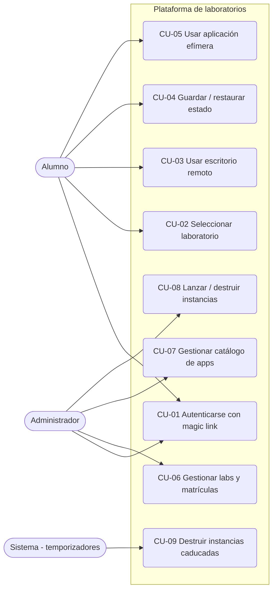
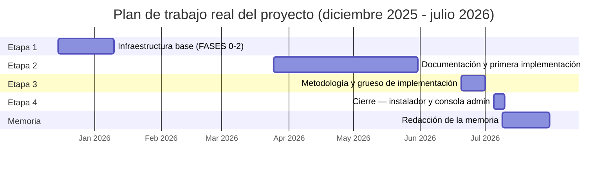

# Capítulo 3. Análisis del problema

Este capítulo analiza el problema que la plataforma resuelve antes de abordar su diseño: requisitos (3.1), casos de uso (3.2), seguridad (3.3), marco legal y ético (3.4), riesgos (3.5), soluciones posibles (3.6), solución propuesta y plan de trabajo (3.7) y presupuesto (3.8).

## 3.1 Especificación de requisitos

Los requisitos se especificaron a partir de las notas de diseño originales y del escenario docente descrito en el Capítulo 1: un único servidor debe entregar a cada alumno matriculado un escritorio Linux persistente y un catálogo de aplicaciones web efímeras, accesibles solo desde un navegador, con administración centralizada y sin intervención manual por instancia. <!-- fuente: Entorno de Laboratorio con LXD.md:Objetivo --> Cada requisito se documenta con cuatro campos (identificador, descripción, prioridad y fuente): la prioridad distingue lo *esencial* (sin ello el sistema no cumple su propósito) de lo *importante* (valor operativo o de seguridad exigible en producción), y la fuente remite a la funcionalidad realmente documentada, no a una aspiración.

Los requisitos funcionales (RF) derivan de la funcionalidad ofrecida a alumno, administrador y al propio sistema como actor automático. <!-- fuente: docs/USO.md:Para el alumno; docs/USO.md:Para el administrador --> Los no funcionales (RNF) proceden de las reglas de diseño innegociables del proyecto: ningún puerto de escritorio remoto expuesto, perfiles restringidos, automatización completa por CLI, aislamiento de red y caducidades estrictas de sesión. <!-- fuente: CLAUDE.md:Golden rules; README.md:Identidad y seguridad --> La Tabla 3.1 recoge ambos conjuntos.

| Id | Descripción | Prioridad | Fuente |
|---|---|---|---|
| RF-01 | Autenticación por correo, canjeando un *magic link* de un solo uso (15 min); sin contraseñas de alumno. | Esencial | `docs/USO.md`; `provision/auth.py` |
| RF-02 | Con varias matrículas, panel (*dashboard*) con laboratorios y apps; con una sola, acceso directo. | Esencial | `docs/USO.md` |
| RF-03 | Al abrir el escritorio, lanzamiento bajo demanda y configuración automática de la VM si no existe; escritorio MATE en el navegador. | Esencial | `docs/USO.md`; `provision/jobs.py` |
| RF-04 | Guardado autónomo del estado (`lab-save`, hasta 5 instantáneas rotadas) y restauración a base (`lab-reset`) desde la propia VM. | Esencial | `docs/USO.md:Scripts de laboratorio` |
| RF-05 | Apertura de aplicaciones web efímeras (compartidas o individuales) desde el navegador; reinicio de las individuales. | Importante | `docs/USO.md:Apps stateless` |
| RF-06 | *Magic link* propio de administrador (5 min), circuito independiente; segundo factor TOTP previsto en el esquema, no verificado aún (Cap. 9). | Esencial | `docs/USO.md:Consola admin`; `provision/db.py` |
| RF-07 | Consola de administración: gestión de laboratorios, matrículas y catálogo de apps; listar, lanzar o destruir instancias. | Esencial | `docs/USO.md:Consola admin` |
| RF-08 | Destrucción automática de instancias inactivas (60 min VMs, 30 min apps individuales); destrucción por plazo del curso documentada, pendiente en el *reaper* (Cap. 9). | Esencial | `docs/USO.md:Sesión y caducidad`; `provision/reap.py` |
| RF-09 | Latido periódico de cada VM ante el orquestador; en apps, la actividad se marca al lanzar/reiniciar (sin latido propio, Cap. 9). | Importante | `provision/main.py`; `provision/apps.py` |
| RNF-01 | Ningún puerto de escritorio remoto (3389/5900) accesible desde el exterior; todo acceso RDP pasa por guacd. | Esencial | `CLAUDE.md:Golden rules`; `README.md:Arquitectura` |
| RNF-02 | Perfil LXD restringido con cuotas (VM: 4 GB/4 vCPU; contenedor: 2 GB/2 vCPU), nunca el perfil por defecto. | Esencial | `CLAUDE.md:Golden rules`; `lxd-preseed.yaml` |
| RNF-03 | Toda operación reproducible por CLI/script, sin pasos manuales; scripts idempotentes. | Esencial | `CLAUDE.md:Golden rules`; `nginx/iptables-lab.sh` |
| RNF-04 | Aislamiento de red entre alumnos: tráfico inter-VM, inter-app y app↔VM descartado en el cortafuegos. | Esencial | `nginx/iptables-lab.sh`; `nginx/iptables-apps.sh` |
| RNF-05 | Sesiones acotadas: cookie de alumno 1 h, de administrador 30 min sin renovación; enlaces de 15/5 min de un solo uso. | Esencial | `README.md:Identidad y seguridad` |
| RNF-06 | Identidad solo desde el JWT verificado en servidor; cabeceras de identidad del cliente eliminadas. | Esencial | `provision/main.py` (middleware) |
| RNF-07 | Ningún componente almacena contraseñas de alumnos. | Esencial | `Entorno de Laboratorio con LXD.md:Autenticación` |
| RNF-08 | Consumo de almacenamiento gobernado: la política de instantáneas se degrada y rechaza antes de agotar el *pool* (60/75/90 %). | Importante | `provision/policy.py`; `README.md:Ciclo de vida` |
| RNF-09 | CSP sin scripts embebidos; aplicaciones en marcos *sandbox* aislados. | Importante | `README.md:Identidad y seguridad` |
| RNF-10 | Instalación completa con un comando, precedida de verificación del host que aborta antes de tocar el sistema. | Esencial | `install-all.sh`; `README.md:Instalación` |

*Tabla 3.1. Requisitos funcionales y no funcionales del sistema. Elaboración propia a partir de la funcionalidad y las reglas de diseño del proyecto.*

Los requisitos trazan con los objetivos de 1.2: OE1 en RNF-01 (su criterio medible directo) y, de forma indirecta, en RNF-04 (el aislamiento entre alumnos impide además que una VM comprometida alcance lateralmente un puerto de escritorio de otro alumno); OE2 en RF-01, RF-03, RF-04, RF-08 y RF-09; OE3 en RF-05 y en RNF-04 (su criterio medible propio: reglas de descarte inter-VM, inter-app y app↔VM); OE4 en RNF-03 y RNF-10; OE5 se aborda en 3.3 y 3.5, y en el Capítulo 7.

## 3.2 Casos de uso

La Figura 3.1 modela la interacción de los tres actores con el sistema: el **Alumno** (usuario final), el **Administrador** (docente u operador) y el **Sistema** (procesos automáticos programados, los *reapers*, que actúan sin intervención humana). <!-- fuente: docs/USO.md; systemd/ -->

*Figura 3.1. Diagrama de casos de uso de la plataforma (representado con notación de diagrama de flujo equivalente al UML de casos de uso). Elaboración propia.*

Se detalla con plantilla el caso de uso más representativo del sistema; el resto queda descrito por los requisitos de la Tabla 3.1 y por el manual de usuario del Anexo A2, con correspondencia directa: CU-01↔RF-01/RF-06, CU-02↔RF-02, CU-03↔RF-03, CU-04↔RF-04, CU-05↔RF-05, CU-06/CU-07/CU-08↔RF-07 y CU-09↔RF-08. <!-- fuente: Entorno de Laboratorio con LXD.md:Flujo de autenticación -->

**CU-03 — Usar escritorio remoto.** *Actor:* Alumno. *Precondición:* sesión válida con laboratorio seleccionado. *Flujo principal:* (1) el alumno pulsa «Abrir escritorio»; (2) si no existe su VM, el orquestador encola su creación y la configura automáticamente en el primer arranque (1-3 minutos); (3) el proxy, validada la sesión en cada petición, enruta al túnel de escritorio remoto hasta el puerto RDP interno de la VM, nunca expuesto al exterior; (4) el alumno trabaja desde el navegador mientras la VM acredita actividad periódicamente. *Flujo alternativo:* sin laboratorio seleccionado o con la sesión caducada, el proxy rechaza la petición. *Postcondición:* la VM queda activa; si permanece inactiva 60 minutos, el caso CU-09 la destruye (el trabajo guardado con CU-04 se conserva mientras la VM exista). <!-- fuente: docs/USO.md:Para el alumno; README.md:Arquitectura -->

## 3.3 Análisis de seguridad

La plataforma expone a Internet un portal usado por decenas de alumnos y ejecuta, sobre el mismo servidor, código arbitrario dentro de las VMs y aplicaciones de esos alumnos: cualquier análisis debe asumir que un alumno (o un atacante con su sesión) es un adversario potencial con capacidad de ejecutar código dentro de la infraestructura. En lugar de recorrer un catálogo genérico de amenazas, el modelo se organiza por las cuatro superficies reales de la plataforma —identidad, red, aplicación y registros—, lo que permite trazar cada amenaza a su mitigación implantada. <!-- fuente: README.md:Identidad y seguridad -->

**Identidad.** La autenticación sin contraseñas elimina el almacenamiento de credenciales en la plataforma y su reutilización entre servicios: no hay contraseñas que exfiltrar de la base de datos, y los enlaces de acceso son de un solo uso y validez corta. El vector residual —el compromiso del buzón de correo del alumno— se asume como riesgo delegado en el proveedor de identidad de correo, equivalente al de cualquier flujo de restablecimiento de contraseña. La sesión resultante es un testigo JWT firmado con caducidad estricta; los circuitos de alumno y de administrador usan secretos de firma distintos, de modo que el compromiso de uno no afecta al otro, y la cookie de administrador queda confinada a la ruta de la consola. El alta de administradores no existe como función de la consola ni de la API: se realiza únicamente por SQL sobre el servidor, para que el privilegio máximo no sea alcanzable desde la propia aplicación web. <!-- fuente: provision/auth.py; docs/USO.md:Consola admin -->

**Red.** El único servicio publicado a Internet es el proxy en los puertos 80/443; el túnel de escritorio remoto y la base de datos de Guacamole escuchan solo en la interfaz local del host, mientras que la API interna escucha además en los puentes internos —deliberadamente, para recibir las señales de vida de VMs y aplicaciones— sin estar publicada en el cortafuegos perimetral. Dentro del servidor, reglas de cortafuegos descartan todo el tráfico entre VMs de alumnos, entre contenedores de aplicaciones y entre ambos mundos, de forma que una instancia comprometida no puede desplazarse lateralmente hacia las de otros alumnos; el puerto RDP de cada VM y los puertos HTTP de las aplicaciones solo son alcanzables desde el propio host (por el túnel y el proxy/orquestador, respectivamente). <!-- fuente: README.md:Arquitectura; systemd/provision.service (bind 0.0.0.0); DOIN.md; nginx/iptables-lab.sh; nginx/iptables-apps.sh -->

**Aplicación.** Toda petición atraviesa una puerta de autenticación en el proxy que consulta al orquestador antes de enrutar; la identidad viaja en cabeceras que el proxy fija a partir del JWT y que un *middleware* (una capa de código que intercepta toda petición entrante antes de que llegue a su destino) del orquestador elimina si llegan del cliente, impidiendo su falsificación. Un secreto compartido adicional entre proxy y orquestador (defensa en profundidad) permite distinguir el tráfico legítimo del proxy de accesos directos, y el mismo *middleware* bloquea que las VMs y aplicaciones —que sí necesitan alcanzar la API para sus señales de vida— invoquen rutas reservadas al navegador. Las VMs y aplicaciones se autentican con testigos de servicio de alcance mínimo (guardar, restaurar o latir) ligados a su IP, y jamás ejecutan órdenes de virtualización. El portal se protege frente a inyección de código con una CSP sin scripts embebidos, y las aplicaciones se muestran en marcos *sandbox* sin acceso al origen del portal, por lo que no pueden leer sus cookies; la cabecera que indica al proxy el destino interno de cada aplicación la genera siempre el servidor, nunca el cliente, cerrando la vía de SSRF (una petición que el propio servidor emitiría hacia un destino interno elegido por el atacante en vez de por el operador). <!-- fuente: provision/main.py (middleware); provision/auth.py; docs/DEPLOY.md:Anexo B.3 -->

**Registros.** Los registros del sistema se consideran también superficie de ataque (un registro con secretos convierte su lectura en un compromiso de sesión): los enlaces de acceso se enmascaran antes de escribirse (se sustituye el testigo por un marcador) y los secretos compartidos y destinos internos no se registran nunca. <!-- fuente: README.md:Identidad y seguridad; docs/DEPLOY.md:Anexo B.5 -->

La Tabla 3.2 sintetiza las amenazas concretas y su mitigación, con la evidencia verificable en el repositorio.

| Amenaza | Mitigación | Evidencia |
|---|---|---|
| Robo o reutilización de credenciales | Sin contraseñas: *magic link* de un solo uso (15/5 min) + JWT firmado de vida corta | `provision/auth.py` |
| Compromiso del buzón de correo del alumno | Riesgo delegado en el proveedor de correo (equivalente al restablecimiento de contraseña); enlaces de un solo uso y sesiones de 1 h acotan la ventana | `provision/auth.py` |
| Abuso de recursos del host desde una instancia | Cuotas de CPU/RAM por perfil (RNF-02) y destrucción por inactividad | `lxd-preseed.yaml`; `provision/reap.py` |
| Falsificación de identidad por cabeceras HTTP | El proxy sobrescribe la identidad desde el JWT; el orquestador elimina las cabeceras forjadas del cliente | `provision/main.py` |
| Acceso directo al escritorio remoto (3389/5900) | guacd como único intermediario; servicios internos en interfaz local; solo 80/443 publicados | `README.md:Arquitectura`; `guacamole/docker-compose.yml` |
| Evasión del proxy (acceso directo a la API) | Secreto interno proxy→API (≥32 bytes) + *middleware* que bloquea las rutas de navegador a las instancias; la lista blanca de cortafuegos del puerto 8000 queda pendiente de instalar (origen del hallazgo en la sección 5.2) | `provision/main.py`; `nginx/install.sh` |
| Movimiento lateral entre alumnos | Descarte (DROP) de tráfico inter-VM, inter-app y app↔VM | `nginx/iptables-lab.sh`; `nginx/iptables-apps.sh` |
| Escalada desde una instancia comprometida | Testigos de servicio con alcance mínimo y ligados a IP; las instancias no ejecutan órdenes `lxc` | `provision/auth.py` |
| Inyección de código en el portal (XSS) | CSP `script-src 'self'` sin código embebido; construcción del DOM sin interpolar HTML | `provision/web/` |
| Lectura de cookies por una aplicación embebida | *iframe* con `sandbox` sin `allow-same-origin` (contexto de origen distinto) | `README.md:Identidad y seguridad` |
| SSRF a través del proxy de aplicaciones | El destino interno lo emite la API tras validar la pertenencia app↔alumno, nunca el cliente | `docs/DEPLOY.md:Anexo B.3` |
| Fuga de secretos por registros | Enlaces redactados; secretos y destinos internos nunca registrados | `docs/DEPLOY.md:Anexo B.5` |

*Tabla 3.2. Modelo de amenazas: amenaza, mitigación implantada y evidencia en el repositorio. Elaboración propia.*

## 3.4 Marco legal y ético

**Protección de datos.** La plataforma trata datos personales de estudiantes y queda sujeta al Reglamento General de Protección de Datos (Unión Europea, 2016) y a su desarrollo español, la LOPDGDD (Ley Orgánica de Protección de Datos Personales y garantía de los derechos digitales; España, 2018). Los datos tratados son mínimos: correo del alumno, un identificador opaco, marcas de actividad y, con fin exclusivo de seguridad, direcciones IP de enlaces canjeados, accesos de administración y VMs (también dato personal); no se almacenan contraseñas (RNF-07) ni categorías especiales, y los registros excluyen secretos y enlaces de sesión, lo que materializa la minimización del artículo 5.1.c). <!-- fuente: provision/db.py (enrollments, auth_tokens.used_from_ip, admin_logins, vm_tokens.vm_ip); README.md:Identidad y seguridad --> La conservación se limita al contenido de trabajo: VMs y aplicaciones se destruyen por inactividad o al vencer el curso. <!-- fuente: provision/reap.py; docs/USO.md:Sesión y caducidad --> Como límite honesto, las filas históricas no se purgan automáticamente, por lo que ejercer el derecho de supresión exige hoy intervención manual (Capítulo 9). <!-- fuente: docs/DEPLOY.md:Deudas y límites conocidos --> En una implantación real el responsable sería la institución educativa, con obligaciones organizativas (base de licitud, registro de actividades, información al alumnado y, en administración pública, el Esquema Nacional de Seguridad) que exceden el alcance técnico de este trabajo.

**Propiedad intelectual y licencias.** Toda la pila es software libre: LXD bajo AGPL-3.0 desde su relicenciamiento por Canonical a finales de 2023[^1]; Guacamole, Apache-2.0; Nginx, BSD de dos cláusulas[^2]; FastAPI, MIT[^3]; SQLite, dominio público[^4]. Usar y orquestar estos componentes sin modificarlos es compatible con todas ellas, incluida la AGPL, cuyas obligaciones de publicación solo afectarían a modificaciones del propio LXD, inexistentes aquí. La licencia del código propio queda pendiente de decisión del autor [RELLENAR: decidir y declarar la licencia del repositorio].

**Ética.** El sistema registra solo la actividad necesaria para operar, sin capturar pantallas ni pulsaciones, y comunica al alumno los plazos exactos de sus decisiones automáticas. <!-- fuente: docs/USO.md:Sesión y caducidad --> El uso de asistentes de IA en el desarrollo se declara abiertamente (1.4 y 5.1), con el autor manteniendo la revisión y responsabilidad sobre todo artefacto; la equidad de acceso se trató como ODS 10 en 1.3.

## 3.5 Análisis de riesgos

La Tabla 3.3 recoge los riesgos identificados, clasificados por tipo, con probabilidad e impacto cualitativos y su mitigación; todos proceden de límites documentados del propio proyecto, no de un catálogo genérico. <!-- fuente: docs/DEPLOY.md:Deudas y límites conocidos; docs/DEPLOY.md:0b -->

| Riesgo | Tipo | Prob. | Impacto | Mitigación |
|---|---|---|---|---|
| Saturación del almacenamiento de VMs (*pool* 40 GB, cota de 2-3 alumnos con retención completa; sección 7.3) | Operativo | Alta | No se puede guardar ni lanzar | Guardián del *pool*: >60 % reduce retención, >75 % purga la instantánea más antigua, >90 % rechaza (cierre seguro) |
| Pérdida de trabajo del alumno (inactividad o reinicio fallido) | Operativo | Media | Repetición de prácticas | Instantáneas en autoservicio (`base`+`k1..k5`); plazos de inactividad documentados |
| Servidor único como punto de fallo (SPOF) | Técnico | Baja | Indisponibilidad total | Riesgo asumido a escala de asignatura; instalación reproducible; multi-host como trabajo futuro |
| Dependencia del proveedor SMTP para el acceso | Externo | Media | Nadie puede iniciar sesión | Respuesta neutra y reintento manual; proveedor transaccional recomendado en producción |
| Recarga destructiva del *preseed* de LXD (borra *pools* y redes) | Operativo | Baja | Pérdida de VMs y almacenamiento | Exige `--force-preseed` explícito; ampliaciones de *pool*/subred por vías no destructivas |
| Servicio en el grupo `lxd` (equivalente a root) | Seguridad | Baja | Escalada total si se compromete | Deuda documentada; usuario dedicado; envoltorio sudo como trabajo futuro |
| Host de despliegue inadecuado (sin KVM/ZFS, puertos ocupados) | Implantación | Media | Instalación fallida | *Preflight* que aborta antes de tocar el sistema y avisa de carencias |
| Discontinuidad del esfuerzo del autor | Gestión | Alta (materializado; 3.7) | Retraso del proyecto | Fases con criterios de aceptación que preservan el avance entre parones |

*Tabla 3.3. Análisis de riesgos: tipo, probabilidad cualitativa, impacto y mitigación. Elaboración propia a partir de las deudas y límites documentados del proyecto.*

## 3.6 Identificación y análisis de soluciones posibles

Antes de fijar la solución se evaluaron alternativas reales para cada decisión estructural, con cuatro criterios declarados: **coste** (licencias y operación), **aislamiento** (entre alumnos y frente al exterior), **persistencia** (capacidad de conservar el trabajo del alumno) y **complejidad** (de implantación y operación a escala de una asignatura). El estado del arte que fundamenta el contexto de cada familia tecnológica se expuso en el Capítulo 2 y no se repite aquí. La Tabla 3.4 resume la evaluación.

| Decisión | Alternativas | Evaluación según criterios | Elección |
|---|---|---|---|
| Capa de virtualización | LXD / Docker / KVM-libvirt puro / Proxmox VE | Docker: gran densidad pero contenedores de aplicación, sin escritorio persistente natural y aislamiento más débil. KVM puro: aislamiento máximo pero sin gestión de imágenes, perfiles ni instantáneas (todo a construir). Proxmox: plataforma completa pero orientada a administrar infraestructura, no a orquestarse desde una API propia; sobredimensionada para un host. LXD: VMs y contenedores bajo una misma CLI automatizable, con instantáneas ZFS y perfiles de cuota. | **LXD** |
| Acceso al escritorio | Guacamole+guacd / exponer xrdp / noVNC | Exponer xrdp: mínima complejidad pero un puerto RDP por alumno abierto a Internet (aislamiento inaceptable). noVNC: solo cliente VNC, exigiría un servidor VNC por VM. Guacamole: pasarela HTML5 que concentra el acceso en 443 y mantiene 3389 interno. | **Guacamole** |
| Base de datos | SQLite / PostgreSQL | PostgreSQL: más concurrencia de escritura, pero un servicio más que instalar, asegurar y respaldar. SQLite en modo WAL: cero administración, suficiente hasta ≈50 alumnos (un solo escritor, cota documentada). | **SQLite** |
| Autenticación | *Magic link* / usuario y contraseña | Contraseñas: altas manuales, almacenamiento con *hash*, restablecimientos, riesgo de reutilización. *Magic link*: nada que almacenar ni restablecer; a cambio, dependencia del correo (riesgo asumido en la Tabla 3.3). | ***Magic link*** |
| Conservación del trabajo | Instantáneas LXD/ZFS / copias de seguridad externas | Copias externas: protegen frente a fallo del host pero exigen infraestructura adicional y no son operables por el alumno. Instantáneas ZFS: coste marginal casi nulo, creación en segundos, autoservicio; no protegen frente a fallo del disco (parte del SPOF asumido). | **Instantáneas** |

*Tabla 3.4. Alternativas evaluadas por decisión estructural y criterio de selección. Elaboración propia.* <!-- fuente: Entorno de Laboratorio con LXD.md:Restricción firme y Arquitectura; DOIN.md; docs/DEPLOY.md:Anexo B.1 -->

Tres observaciones completan la tabla. Primera: la elección de LXD no es solo comparativa sino estructural —su dualidad VM/contenedor permite resolver con una única herramienta los dos modos de entrega que el problema exige (escritorios persistentes con aislamiento fuerte y aplicaciones efímeras densas), evitando mantener dos pilas de virtualización—; frente a su derivado comunitario Incus (sección 2.2), funcionalmente equivalente en lo que este proyecto emplea, se mantuvo LXD por ser la pieza fijada en las notas de diseño originales y estar disponible como paquete oficial soportado en Ubuntu Server. <!-- fuente: Entorno de Laboratorio con LXD.md:Objetivo; server-setup-lxd.sh (snap lxd) --> Segunda: dentro del despliegue de Guacamole se evaluaron dos variantes de red (contenedores en modo *host* con servicios ligados a la interfaz local, frente a guacd nativo con *socket* Unix); se adoptó la primera por simplicidad en host único, dejando la segunda documentada como evolución para producción multi-host. <!-- fuente: docs/DEPLOY.md:Anexo B.1 --> Tercera: en autenticación existe una alternativa adicional en contexto universitario, la identidad institucional (SSO/LDAP del centro), que también evitaría contraseñas locales; se descartó porque acopla la plataforma al directorio de cada institución y penaliza su transferibilidad, y su integración se recoge como línea futura (Capítulo 9). <!-- fuente: [ELABORAR: decisión razonada sin evidencia documental en el repo] -->

## 3.7 Solución propuesta y plan de trabajo

La solución es una plataforma integrada sobre un único servidor Ubuntu: LXD como capa de virtualización dual, Apache Guacamole como pasarela de escritorio en el navegador, Nginx como proxy con puerta de autenticación centralizada y un orquestador propio (FastAPI) que implementa la identidad, el aprovisionamiento bajo demanda, la política de instantáneas, la destrucción automática y la consola de administración. Su construcción se organizó en siete fases incrementales con criterios de validación propios: infraestructura e imagen base, identidad y autenticación, configuración por alumno con cloud-init, provisión bajo demanda, acceso web (Guacamole, Nginx, TLS, aislamiento de red), políticas de ciclo de vida, y portal con aplicaciones efímeras y consola de administración. <!-- fuente: docs/DEPLOY.md (fases 0-6) -->

El plan de trabajo real, reconstruido del historial del repositorio, comprende cuatro etapas entre diciembre de 2025 y julio de 2026, que la Figura 3.2 representa. <!-- fuente: git log del repositorio -->

*Figura 3.2. Plan de trabajo real derivado del historial de commits del repositorio. Elaboración propia.*

La distribución merece una reflexión crítica honesta. No se formalizó un cronograma inicial —carencia que es en sí misma parte de la lección aprendida—: el planteamiento implícito era un avance lineal por fases, y la realidad fue intermitente: arranque intenso en diciembre-enero, febrero sin actividad, y marzo-mayo combinando documentación, refactorización y una primera iteración de implementación al compaginar el proyecto con otras obligaciones. El grueso se concentró en junio, coincidiendo con la adopción de la metodología de agentes del Capítulo 5 —cuyo peso real frente al de tener ya fijada la arquitectura se matiza en 5.1—; el cierre se completó en julio. La lección es doble: la estimación inicial infravaloró el coste de integración y sobrevaloró la continuidad del esfuerzo, y concentrar la implementación al final solo fue viable porque las fases tempranas ya habían fijado la arquitectura y sus reglas. En horas-persona —estimación declarada a partir de la densidad del historial, sin registro horario que la respalde— el esfuerzo se aproxima a 300 horas: unas 70 en la etapa 1, 40 en la 2, 120 en la 3 y 70 en la 4.

## 3.8 Presupuesto

La Tabla 3.5 estima el coste de ejecutar este proyecto como encargo real. Todas las cifras son estimaciones declaradas, sin fuente salarial ni de mercado citada: la tarifa de 20 €/hora es un supuesto de coste-empresa para un perfil junior en España; el hardware es el servidor de referencia del análisis de capacidad (KVM, 32 GB de RAM —el instalador admite desde 8 GB— y ≥100 GB de disco), imputado íntegramente por quedar dedicado a la plataforma. <!-- fuente: DOIN.md:Cotas de escalabilidad (host 32GB); install-all.sh (preflight RAM/disco); docs/DEPLOY.md:0 -->

| Concepto | Detalle | Coste estimado |
|---|---|---|
| Recursos humanos | ≈300 h × 20 €/h (coste-empresa junior, supuesto declarado) | 6.000 € |
| Hardware | Servidor con KVM, 32 GB RAM, ≥100 GB libres en disco (imputación íntegra) | 1.200 € |
| Software | Pila íntegramente FOSS (sin licencias) | 0 € |
| Operación (anual) | Dominio y conectividad/energía del servidor (supuesto declarado, sin desglose) | ≈150 €/año |
| **Total del proyecto** | (sin costes recurrentes) | **≈7.200 €** |

*Tabla 3.5. Presupuesto estimado del proyecto. Elaboración propia; cifras declaradas como estimación.*

El análisis realizado —requisitos, amenazas, riesgos y alternativas— fija el marco del diseño. El Capítulo 4 traduce estas decisiones en la arquitectura del sistema: topología de servicios, diseño del orquestador y mecanismos que materializan los requisitos aquí especificados.

[^1]: Anuncio de cambio de licencia de LXD a AGPL-3.0. Canonical, diciembre de 2023. https://discourse.ubuntu.com/t/lxd-is-now-re-licensed-and-under-a-cla/41335 [consulta: 15 de julio de 2026].
[^2]: Nginx, servidor web y proxy inverso (licencia BSD de 2 cláusulas). https://nginx.org/LICENSE [consulta: 15 de julio de 2026].
[^3]: FastAPI, framework web para Python (licencia MIT). https://fastapi.tiangolo.com/ [consulta: 15 de julio de 2026].
[^4]: SQLite, motor de base de datos embebido (dominio público). https://sqlite.org/copyright.html [consulta: 15 de julio de 2026].
