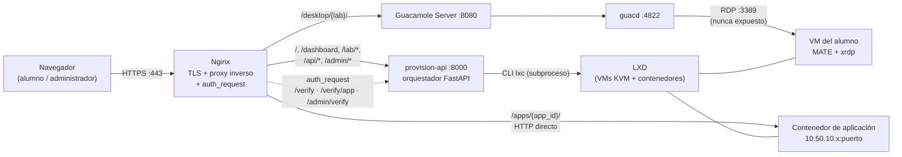
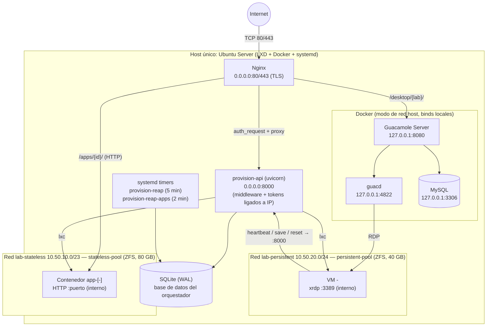
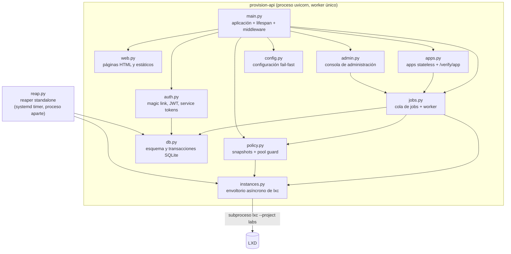
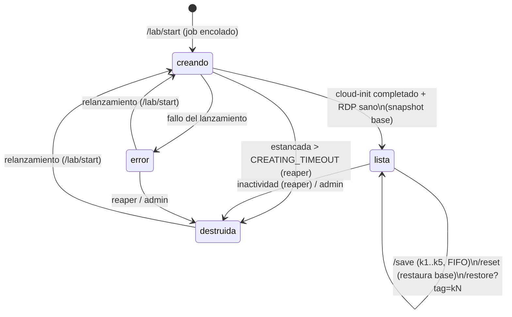

# Capítulo 4. Diseño de la solución

Este capítulo traduce los requisitos y la solución del Capítulo 3 a un diseño concreto: arquitectura global y flujos, diseño detallado del orquestador —módulos, datos y ciclo de vida—, diseño de seguridad y pila tecnológica empleada.

## 4.1 Arquitectura del sistema

El sistema sigue un patrón de **proxy inverso con puerta de autenticación centralizada** delante de un **orquestador** y de dos *backends* de virtualización sobre un único servidor. Nginx es el único servicio publicado a Internet (puerto 443 con TLS; el 80 solo redirige y atiende el reto de certificación): recibe todas las peticiones y, antes de enrutar cada petición a una ruta protegida, consulta mediante el mecanismo `auth_request` a la API de aprovisionamiento (*provision-api*), que valida la sesión y devuelve la identidad; solo si esa consulta interna responde con éxito la petición continúa hacia su destino. Detrás del proxy conviven tres destinos: el propio orquestador (portal, API y consola de administración), la pasarela de escritorio remoto Apache Guacamole y los contenedores de aplicaciones. <!-- fuente: README.md:Arquitectura; nginx/lab.conf --> La Figura 4.1 muestra los bloques y sus relaciones.

*Figura 4.1. Arquitectura general de la plataforma: bloques y rutas de enrutado. Elaboración propia a partir de la topología documentada del proyecto.* <!-- fuente: README.md:Arquitectura -->

Sobre esta estructura se producen tres flujos característicos. El primero es la **petición autenticada genérica**: para las rutas del portal (`/dashboard`, `/lab/*`, `/api/*`) y de la consola (`/admin/*`), Nginx emite una subpetición interna a `/verify` (o `/admin/verify`) de *provision-api*, que valida el JWT de la *cookie* y responde 200 con cabeceras de identidad o 401; en el segundo caso el cliente nunca alcanza el destino. <!-- fuente: nginx/lab.conf; provision/auth.py --> El segundo es el **túnel de escritorio remoto**: una petición a `/desktop/{lab}/` supera la misma puerta (que además exige que la sesión tenga un laboratorio activo y que coincida con el de la ruta) y se reenvía al servidor Guacamole, que delega en el demonio *guacd* la conexión RDP contra la VM del alumno; el navegador solo habla HTTPS/WebSocket, y el puerto RDP 3389 no se expone jamás fuera del host. <!-- fuente: nginx/lab.conf; docs/DEPLOY.md:Anexo B --> El tercero es el **proxy directo de aplicaciones**: las rutas `/apps/{app_id}/` se validan contra `/verify/app`, que comprueba la pertenencia de la aplicación al alumno y devuelve la cabecera `X-App-Target` con el destino interno; Nginx reenvía entonces el HTTP directamente al contenedor, sin pasar por *guacd*, que es un intermediario exclusivo de los protocolos de escritorio remoto. <!-- fuente: nginx/lab.conf; docs/DEPLOY.md:Anexo B.3 --> La Tabla 4.1 resume qué escucha cada servicio y quién puede alcanzarlo.

| Servicio | Escucha en | Origen permitido | Destino al que reenvía |
|---|---|---|---|
| Nginx | 0.0.0.0:80/443 | Internet (TLS) | provision-api :8000 / Guacamole :8080 / contenedor de aplicación |
| provision-api | 0.0.0.0:8000 | Nginx (127.0.0.1), VMs (10.50.20.0/24) y aplicaciones (10.50.10.0/23); control por *middleware* de rutas y testigos ligados a IP (la lista blanca iptables del puerto está documentada como endurecimiento pendiente) | — |
| Guacamole Server | 127.0.0.1:8080 | Nginx (interfaz local) | guacd :4822 |
| guacd | 127.0.0.1:4822 | Guacamole (interfaz local) | VM 10.50.20.x:3389 |
| MySQL (Guacamole) | 127.0.0.1:3306 | Guacamole (interfaz local) | — |
| Aplicación *stateless* | 10.50.10.x:puerto | Nginx (10.50.10.1) | — |

*Tabla 4.1. Servicios, puntos de escucha y orígenes permitidos. Elaboración propia a partir de la tabla de puertos del proyecto; el punto de escucha del servidor Guacamole procede de la configuración documentada y debe verificarse en el despliegue (`ss -tlnp`).* <!-- fuente: README.md:Arquitectura; guacamole/docker-compose.yml -->

Todo el sistema se despliega en **un único host** Ubuntu Server, decisión ya justificada en el análisis de alternativas (sección 3.6) y asumida como riesgo en la sección 3.5: a escala de una asignatura, la simplicidad operativa de un servidor prima sobre la alta disponibilidad. Dentro del host, LXD organiza los recursos en un proyecto dedicado (`labs`) con dos *pools* de almacenamiento ZFS —`persistent-pool` (40 GB) para las VMs de alumnos y `stateless-pool` (ampliado a 80 GB en la instalación) para los contenedores de aplicaciones— y dos redes puente aisladas para las instancias de alumnos: `lab-persistent` (10.50.20.0/24) para las VMs y `lab-stateless` (10.50.10.0/23, ampliada desde /24) para las aplicaciones (el preseed define además una red y un perfil de administración, omitidos aquí por claridad). Cada instancia se lanza siempre con un perfil restringido (`persistent`: 4 CPU y 4 GB de RAM; `stateless`: 2 CPU y 2 GB), nunca con el perfil por defecto de LXD, de modo que las cuotas de recursos y la red asignada quedan fijadas por diseño. <!-- fuente: lxd-preseed.yaml; README.md:Instalación; CLAUDE.md:Golden rules --> Sobre estas redes, reglas iptables descartan el tráfico entre VMs, entre aplicaciones y entre ambos mundos, como se analizó en la sección 3.3. <!-- fuente: nginx/iptables-lab.sh; nginx/iptables-apps.sh --> La Figura 4.2 sitúa cada servicio, red y puerto en el despliegue físico.

*Figura 4.2. Diagrama de despliegue: servicios, puntos de escucha, redes internas y pools de almacenamiento sobre el host único. Elaboración propia.* <!-- fuente: README.md:Arquitectura; lxd-preseed.yaml; guacamole/docker-compose.yml; systemd/ -->

Como muestra la Figura 4.2, la comunicación es deliberadamente asimétrica: el orquestador gobierna las instancias a través de la CLI de LXD, y las VMs solo pueden responder con señales acotadas (latidos, peticiones de guardado o reinicio) hacia el puerto 8000, cuyo acceso se controla con testigos ligados a IP y con el *middleware* de rutas —la lista blanca de cortafuegos de ese puerto queda documentada como endurecimiento pendiente (Capítulo 9)—; las aplicaciones no emiten hoy latido propio (véase 4.2.3) y ninguna instancia ejecuta órdenes de virtualización. <!-- fuente: README.md:Identidad y seguridad; provision/main.py (middleware); install-all.sh (sin reglas INPUT 8000) -->

## 4.2 Diseño detallado

### 4.2.1 Módulos del orquestador

El orquestador (`provision/`) se organiza en once componentes con responsabilidades disjuntas: diez módulos componen la aplicación FastAPI y el undécimo, `reap.py`, es un proceso independiente. Su estructura la muestra la Figura 4.3.

*Figura 4.3. Diagrama de componentes del orquestador: módulos de `provision/` y sus dependencias. Elaboración propia a partir del código fuente.* <!-- fuente: provision/*.py -->

Las responsabilidades son las siguientes. **`main.py`** construye la aplicación y su ciclo de arranque (*lifespan*): al iniciar, reconcilia la base de datos con el estado real de LXD siempre en modo simulado —marca huérfanas, nunca borra a ciegas— y arranca el *worker* de la cola; además aloja el *middleware* de endurecimiento que elimina cabeceras de identidad forjadas por el cliente y bloquea que las instancias invoquen rutas reservadas al navegador. <!-- fuente: provision/main.py; docs/DEPLOY.md:Anexo C.5 --> **`auth.py`** implementa el *magic link* y el JWT del alumno, el circuito separado del administrador y los *service tokens* de VMs y aplicaciones. <!-- fuente: provision/auth.py --> **`instances.py`** es el único punto de contacto con LXD: invoca `lxc` como subproceso asíncrono (nunca mediante llamadas bloqueantes ni con intérprete de órdenes), valida todo nombre contra expresiones regulares cerradas antes de que llegue al comando, y separa deliberadamente el lanzamiento de VMs (`launch`, con `--vm`) del de contenedores (`launch_container`); se eligió la CLI frente a la API REST local del demonio para no gestionar credenciales de confianza adicionales y para que cada orden sea reproducible por el operador (RNF-03). <!-- fuente: provision/instances.py; DOIN.md --> **`jobs.py`** aporta la cola de trabajos persistente y su *worker*; **`policy.py`**, la política de instantáneas y el guardián del *pool*; **`reap.py`**, la destrucción automática (ambos se detallan más abajo). **`apps.py`** gestiona el catálogo de aplicaciones *stateless*, sus lanzamientos —siempre encolados— y el punto de verificación `/verify/app`. <!-- fuente: provision/apps.py --> **`admin.py`** implementa la consola de administración (laboratorios, matrículas, instancias) reutilizando la misma cola para lanzar y el mismo patrón anticarrera para destruir, y deja el alta de administradores deliberadamente fuera de la interfaz. <!-- fuente: provision/admin.py --> **`web.py`** sirve las páginas HTML del portal con CSP estricta; **`db.py`** define el esquema y las transacciones; y **`config.py`** carga la configuración fallando en el arranque si falta algún secreto o mide menos de 32 bytes, para que el servicio nunca arranque firmando sesiones con secretos vacíos. <!-- fuente: provision/web.py; provision/config.py -->

### 4.2.2 Diseño de la base de datos

La persistencia del orquestador es una única base SQLite en modo WAL (*Write-Ahead Logging*), con tiempo de espera de bloqueo de 5 segundos y claves foráneas activadas. La elección se justificó en la sección 3.6; su implicación de diseño es que existe **un solo escritor**: todos los módulos serializan sus escrituras, las operaciones sensibles a carreras usan transacciones `BEGIN IMMEDIATE` (que toman el bloqueo de escritura desde el inicio) y los puntos calientes de solo lectura se diseñan para no escribir, como se verá en la sección 4.3. Coherentemente, la API se sirve con un único proceso *worker* de uvicorn: procesos adicionales no acelerarían al único escritor de SQLite y complicarían la exclusión mutua de la cola de trabajos; la cota de concurrencia resultante se cuantifica en el Capítulo 7. <!-- fuente: provision/db.py; systemd/provision.service (--workers 1) --> La Tabla 4.2 resume las entidades; el DDL completo puede consultarse en `provision/db.py` del repositorio.

| Grupo | Tablas | Contenido y relaciones |
|---|---|---|
| Catálogo docente | `labs`, `enrollments` | Laboratorios (imagen base, fecha límite, activo) y matrículas alumno–laboratorio–curso; el laboratorio de un alumno se deduce de su matrícula, nunca lo elige libremente. |
| Identidad de alumno | `auth_tokens`, `jwt_jti` | *Magic links* almacenados solo como hash SHA-256, con caducidad y marca de uso único; revocación de sesiones JWT por identificador. |
| Identidad de administrador | `admins`, `admin_auth_tokens`, `admin_jwt_jti`, `admin_totp_pending`, `admin_logins` | Circuito paralelo e independiente del de alumnos: cuentas (con columna prevista para un segundo factor TOTP, no implementado en esta versión), enlaces, revocación y auditoría de accesos. |
| Instancias de escritorio | `instancias`, `heartbeats`, `snapshots`, `vm_tokens` | Una VM por (alumno, laboratorio), con estado (`creando`, `lista`, `detenida`, `error`, `destruida`), latidos separados para no competir con el resto de escrituras, inventario de instantáneas (solo caché: la verdad es LXD) y *service token* ligado a la IP de la VM. |
| Aplicaciones | `apps`, `app_lab`, `app_instances`, `app_tokens` | Catálogo (compartida o por alumno, siempre encendida o no, puerto, cuotas), asignación aplicación–laboratorio, instancias con índices únicos parciales que garantizan una sola instancia compartida por aplicación y una por (aplicación, alumno), y una tabla de *tokens* prevista (en esta versión los testigos de las aplicaciones comparten la tabla `vm_tokens`). |
| Operación | `jobs`, `email_outbox`, `schema_version` | Cola de trabajos persistente (`pending`/`running`/`done`/`error`), buzón de correo saliente (usado hoy solo para notificaciones administrativas, sin proceso de reenvío) y versión del esquema para migraciones idempotentes. |

*Tabla 4.2. Entidades de la base de datos del orquestador, agrupadas por función. Elaboración propia a partir del esquema real.* <!-- fuente: provision/db.py -->

### 4.2.3 Ciclo de vida de una instancia

El lanzamiento de una VM no se ejecuta en la petición HTTP que lo solicita: tarda minutos, y una tarea en memoria se perdería si el servicio se reinicia a mitad (las `BackgroundTasks` de FastAPI no sobreviven a un reinicio). Se descartaron también colas externas como Celery o RQ, que exigen un *broker* adicional (Redis o RabbitMQ), contrario a la premisa de host único y mínima operación: una tabla `jobs` en la misma SQLite aporta persistencia y atomicidad con las transacciones ya existentes. Por eso toda creación pasa por la **cola de trabajos persistente**: la petición (`/lab/start`, o su equivalente desde la consola de administración) inserta atómicamente la fila de la instancia en estado `creando` y un trabajo `pending`, y responde de inmediato; un *worker* dedicado reclama los trabajos pendientes dentro de `BEGIN IMMEDIATE` (exclusión mutua), los ejecuta bajo un semáforo que acota los lanzamientos concurrentes según la RAM disponible y, al arrancar el servicio, marca como erróneos los trabajos que quedaron `running`, de modo que el alumno pueda relanzar. <!-- fuente: provision/jobs.py --> El trabajo de lanzamiento renderiza el cloud-init del alumno, lanza la VM, espera a que la inicialización termine, crea la instantánea `base`, comprueba con una verificación de salud que el RDP responde y solo entonces marca la instancia `lista` con su IP (el alta de la conexión en la base de datos de Guacamole está definida como contrato en la documentación de despliegue, pendiente de automatizar; véase el Capítulo 9); cualquier fallo la deja en `error`, y la instancia fallida la retira posteriormente el *reaper*. <!-- fuente: provision/jobs.py (_run_launch); docs/DEPLOY.md:Anexo B.4 (contrato) --> La Figura 4.4 recoge la máquina de estados resultante.

*Figura 4.4. Máquina de estados de una VM de alumno, incluidas las operaciones de instantánea y las vías de destrucción y relanzamiento. El estado `detenida`, previsto en el esquema de datos, carece hoy de operación que lo dispare y se omite. Elaboración propia a partir del código.* <!-- fuente: provision/db.py (CHECK de estados); provision/jobs.py; provision/reap.py -->

Sobre la instancia viva operan dos políticas. La primera es el **esquema de instantáneas**: `base` es inviolable y se crea una sola vez tras el primer arranque sano; `k1..k5` se crean bajo demanda del alumno con rotación FIFO. La fuente de verdad de la rotación es LXD, no un contador en base de datos: en cada guardado se listan las instantáneas reales y se elige el primer hueco libre, lo que evita desincronizaciones si el servicio se reinicia o alguien borra una instantánea a mano. <!-- fuente: provision/policy.py; docs/DEPLOY.md:Anexo C.1 --> Acompaña al esquema un **guardián del *pool*** de cierre seguro (*fail-closed*, es decir, que ante la duda deniega): con el `persistent-pool` por encima del 60 % de uso la retención baja a `k1..k3`; por encima del 75 % se purga la instantánea más antigua antes de crear; por encima del 90 % se rechaza la creación de instantáneas con error 503 (extender ese rechazo al lanzamiento de nuevas VMs, documentado en el proyecto, queda pendiente de implementación; las aplicaciones sí lo comprueban sobre su propio *pool*); y si el uso del *pool* no puede leerse, se asume lo peor y se rechaza, con una caché de 30 segundos que amortigua fallos transitorios de lectura. <!-- fuente: provision/policy.py; provision/jobs.py (check de pool solo en apps) -->

La segunda política es la **destrucción automática**. El *reaper* es un proceso independiente invocado por un temporizador de systemd cada cinco minutos —no un punto de la API del servicio, para no competir con el proceso único del orquestador ni depender de que esté vivo— que destruye instancias inactivas (sin latido durante `IDLE_MINUTES`, 60 minutos por defecto) o estancadas en `creando` más allá de `CREATING_TIMEOUT`; la destrucción por fecha límite del laboratorio o del curso está documentada como configuración, pero el *reaper* no la aplica todavía (Capítulo 9). Su diseño previene explícitamente la condición de carrera TOCTOU (*Time-Of-Check to Time-Of-Use*; véase el Anexo A1): tras seleccionar candidatas, re-comprueba el estado y la inactividad de cada una *dentro* de una transacción `BEGIN IMMEDIATE`; si un latido o un relanzamiento llegó entre la selección y la transacción, la descarta. Confirmada la candidata, ejecuta primero el borrado en LXD —operación idempotente— y, solo si tiene éxito, marca `destruida` y limpia los *tokens*: ese orden evita instancias huérfanas en el hipervisor si el borrado falla; el proceso avanza por lotes con pausas para no saturarlo. <!-- fuente: provision/reap.py --> Las aplicaciones *stateless* siguen un ciclo análogo simplificado —sin instantáneas: su reinicio es destruir y recrear— con un *reaper* y un guardián de *pool* propios; con una salvedad: las aplicaciones carecen hoy de latido propio y su marca de actividad se fija al lanzarlas o reiniciarlas, por lo que la destrucción por inactividad opera en la práctica como un tiempo de vida desde el último lanzamiento (deuda registrada en el Capítulo 9). <!-- fuente: provision/apps.py (last_seen en lanzamiento/reset); provision/reap.py; systemd/ -->

### 4.2.4 Contrato de personalización con cloud-init

Cada VM se personaliza en su primer arranque mediante cloud-init, a partir de una única plantilla (`cloud-init-template.yml`) escrita en Jinja2 y no en la interpolación `${}` nativa de cloud-init: esta solo funciona en unas pocas claves y no admite condicionales, mientras que la plantilla necesita omitir secciones enteras (paquetes, claves SSH, sudo) cuando el laboratorio no las define. <!-- fuente: docs/DEPLOY.md:Anexo A.1 --> El orquestador es el único renderizador y aplica un contrato estricto: las variables procedentes de la petición (alumno y laboratorio) se validan contra expresiones regulares cerradas y el modo de privilegios contra un conjunto cerrado antes del renderizado (cualquier fallo aborta el lanzamiento), el resultado se verifica como YAML válido, y se inyecta a `lxc launch` **por entrada estándar** (`-c user.user-data=-`), nunca como argumento de línea de comandos, lo que elimina la inyección de *flags* y los límites de longitud. El YAML renderizado contiene el *service token* de la VM, por lo que **nunca se escribe a disco**: se genera y consume en memoria. <!-- fuente: docs/DEPLOY.md:Anexo A.3-A.4; cloud-init-template.yml --> La plantilla instala en la VM los scripts de autoservicio (`lab-save`, `lab-reset`, `lab-heartbeat` con su temporizador) y protege su bloque de órdenes con un guardián de idempotencia, de modo que una re-aplicación de cloud-init sea inocua. <!-- fuente: cloud-init-template.yml; docs/DEPLOY.md:Anexo A.5 -->

## 4.3 Diseño de seguridad aplicado

Las amenazas y sus mitigaciones se analizaron en la sección 3.3; esta sección describe solo los mecanismos de diseño que las materializan y que no se detallaron allí. El primero es la **cadena de identidad**: la identidad del usuario existe en un solo lugar, el JWT firmado. Nginx la obtiene en cada petición de la subpetición `auth_request` —el orquestador responde con `X-Lab-Alumno`, `X-Lab-Name` y `X-Lab-Scope`—, sobrescribe siempre `Remote-User` con esos valores y los propaga a los destinos internos; simétricamente, el *middleware* del orquestador elimina esas mismas cabeceras si llegan del cliente. Ningún componente aguas abajo confía, así, en nada que el navegador haya podido escribir. <!-- fuente: nginx/lab.conf; provision/main.py; README.md:Identidad y seguridad -->

El segundo mecanismo son los ***service tokens*** de VMs y aplicaciones: testigos HS256 emitidos en el lanzamiento, con ámbito mínimo (`save`, `reset`, `heartbeat`) y ligados a la IP de la instancia, de modo que uno robado no sirve desde otra máquina ni autoriza operaciones distintas de las previstas. <!-- fuente: provision/auth.py; README.md:Identidad y seguridad -->

El tercero es una decisión de rendimiento con forma de regla: **`/verify/app` es de solo lectura**. Ese punto se ejecuta en cada petición a cada recurso embebido —decenas por segundo con decenas de alumnos— y, si actualizara `last_seen`, saturaría al escritor único de SQLite (4.2.2); por eso nunca escribe, a costa de que la actividad de las aplicaciones solo quede registrada en su lanzamiento y reinicio (4.2.3). <!-- fuente: provision/apps.py (/verify/app read-only); docs/DEPLOY.md:Anexo B.4 -->

## 4.4 Tecnología utilizada

La Tabla 4.3 recoge la pila tecnológica y el papel de cada pieza; las alternativas y sus criterios ya se evaluaron en la sección 3.6 (Tabla 3.4), a la que se remite sin repetir la comparación.

| Herramienta | Papel en el sistema | Alternativa valorada |
|---|---|---|
| Ubuntu Server 22.04/24.04 | Sistema operativo del host único | — |
| LXD | Gestión unificada de VMs y contenedores bajo una CLI automatizable | Docker, KVM-libvirt puro, Proxmox VE (Tabla 3.4) |
| ZFS[^1] | *Backend* de almacenamiento: instantáneas de coste marginal | btrfs / LVM / directorio, sin instantáneas comparables |
| KVM | Hipervisor del núcleo que ejecuta las VMs lanzadas por LXD | — |
| FastAPI + uvicorn[^2] | *Framework* y servidor asíncrono de la API del orquestador | — |
| SQLite (WAL) | Persistencia sin servicio adicional que administrar | PostgreSQL (Tabla 3.4) |
| Jinja2[^3] | Renderizado de la plantilla cloud-init por alumno | Interpolación nativa de cloud-init (4.2.4) |
| Apache Guacamole + guacd | Pasarela HTML5 de escritorio remoto | Exponer xrdp, noVNC (Tabla 3.4) |
| Docker | Empaqueta solo el stack de Guacamole (guacd, servidor, MySQL) | Instalación nativa (evolución documentada) |
| Nginx | TLS, proxy inverso multi-ruta y puerta `auth_request` | — |
| certbot / Let's Encrypt[^4] | Certificados TLS automáticos (reto HTTP-01) | Reto DNS-01 con *wildcard*, innecesario con rutas bajo un dominio |
| systemd | Servicio del orquestador y temporizadores de los *reapers* | — |
| iptables | Aislamiento inter-VM, inter-app y app↔VM (lista blanca del 8000 pendiente) | — |
| xrdp | Servidor RDP dentro de cada VM de alumno | — |
| MATE[^5] | Escritorio ligero de la imagen base (4 GB de RAM por VM) | — |

*Tabla 4.3. Pila tecnológica: papel de cada componente y alternativa evaluada, con remisión a la Tabla 3.4. Las filas con «—» son piezas estándar sin competidor relevante o implícitas en la elección de LXD. Elaboración propia.* <!-- fuente: CLAUDE.md:Architecture; README.md:Estructura del repo; docs/DEPLOY.md:Anexo B.1-B.2 -->

La pila se apoya deliberadamente en tecnologías estándar del ecosistema Linux (Nginx, systemd, iptables, SQLite), de conocimiento previo por la titulación; el aprendizaje real se concentró en tres piezas menos convencionales —proyectos, perfiles y *pools* de LXD; el contrato de renderizado de cloud-init; y la integración de Guacamole con una base de conexiones gestionada desde código propio—, coherente con la concentración de esfuerzo que refleja el plan de trabajo de la sección 3.7. <!-- fuente: plan de trabajo de la sección 3.7 (concentración del esfuerzo en la etapa de implementación) -->

Definida la arquitectura, los módulos, los datos y la tecnología, el capítulo siguiente narra cómo se llevó este diseño a la práctica: organización del desarrollo, problemas reales y decisiones de implementación no previstas sobre el papel.

[^1]: OpenZFS — https://openzfs.org/
[^2]: uvicorn, servidor ASGI para Python — https://www.uvicorn.org/
[^3]: Jinja2, motor de plantillas para Python — https://jinja.palletsprojects.com/
[^4]: certbot (EFF) — https://certbot.eff.org/ ; Let's Encrypt — https://letsencrypt.org/
[^5]: MATE Desktop Environment — https://mate-desktop.org/
