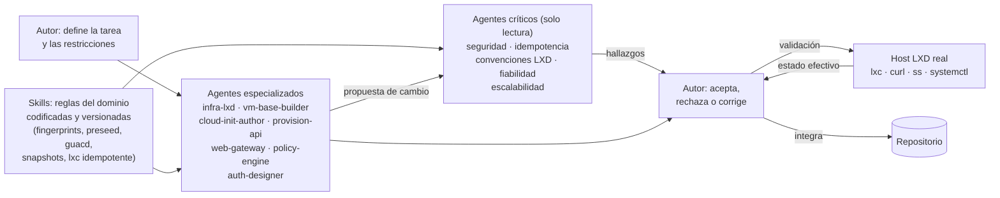

# Capítulo 5. Desarrollo de la solución propuesta

Este capítulo narra el paso del diseño del Capítulo 4 a la solución final: cómo se organizó el trabajo —incluida la metodología de desarrollo asistida por agentes—, qué problemas reales surgieron durante la construcción y cómo se resolvieron, y qué decisiones de implementación merecen justificación detallada. No es un registro cronológico de cambios, sino una selección razonada de problemas y decisiones con su contexto.

## 5.1 Organización del desarrollo

El desarrollo siguió el modelo iterativo e incremental por fases (FASES 0 a 6) declarado en la sección 1.4, sobre el calendario real de cuatro etapas reconstruido en la sección 3.7 (Figura 3.2): infraestructura base en diciembre de 2025 y enero de 2026, documentación y consolidación en primavera, el grueso de la implementación en junio y el cierre de producto —instalador autocontenido y consola de administración— en julio de 2026. Cada fase se dio por terminada solo al superar sus criterios de aceptación, que el Capítulo 7 recoge de forma sistemática. <!-- fuente: git log del repositorio; docs/DEPLOY.md (validación por fases) -->

Al ser un proyecto de infraestructura, no existió una batería de pruebas de integración continua: la validación consistió en ejecutar cada cambio contra un host LXD real y comprobar el estado efectivo del sistema con los propios comandos de la plataforma (`lxc`, `curl`, `ss`, `systemctl`). <!-- fuente: CLAUDE.md:"no lint/typecheck/test suite" --> Esto impuso una disciplina transversal: todos los scripts de infraestructura debían ser **idempotentes**, porque la iteración consistía literalmente en volver a ejecutarlos sobre el mismo host tras cada corrección. <!-- fuente: CLAUDE.md:Golden rules; docs/DEPLOY.md:Validación FASE 0 -->

Sobre esa base se adoptó, a partir de junio de 2026, una metodología de desarrollo asistida por inteligencia artificial en tres tipos de piezas, versionadas en el propio repositorio (`.claude/agents/`, `.claude/skills/`) mediante la herramienta Claude Code[^1]. Primero, **agentes especializados** por dominio (infraestructura LXD, imagen base, cloud-init, orquestador, pasarela web, ciclo de vida, autenticación), cada uno con instrucciones que acotan qué ficheros puede modificar. Segundo, **skills**: reglas del dominio aprendidas durante el proyecto —la triple actualización de huellas de imagen, el carácter destructivo del *preseed*, la obligatoriedad del túnel guacd, la política de instantáneas, los patrones de `lxc` idempotente— para que ningún agente las "olvide" entre sesiones. Tercero, **agentes críticos** de solo lectura (seguridad, idempotencia, convenciones LXD, fiabilidad, escalabilidad) que revisan cada cambio de forma adversarial, sin capacidad de modificar código. <!-- fuente: .claude/agents/; .claude/skills/; CLAUDE.md:Architecture --> La Figura 5.1 esquematiza el flujo.



*Figura 5.1. Metodología de desarrollo con agentes especializados y críticos de revisión: las skills codifican las reglas del dominio, los críticos revisan en modo adversarial y el autor valida todo cambio contra el host real antes de integrarlo. Elaboración propia.* <!-- fuente: .claude/agents/; .claude/skills/ -->

Como se declaró en 1.4, los agentes son una herramienta bajo supervisión, no un desarrollador autónomo. Ningún artefacto se integró sin revisión del autor y validación contra el host real; los hallazgos de los críticos se aceptaron o rechazaron con criterio propio, y varias reglas que las skills codifican proceden de errores depurados a mano (sección 5.2). El indicio observable es el aumento del ritmo de integración en junio (3.7): nueve integraciones frente a cinco entre marzo y mayo, varias de gran alcance, coincidente con la adopción de la metodología de agentes. El número de integraciones es una métrica indirecta de productividad —no distingue tamaño ni complejidad del cambio, y la arquitectura ya fijada por las fases previas también explica parte de la aceleración—; lo más sólido que puede afirmarse es que delegar la escritura mecánica en los agentes, conservando el autor el diseño, la revisión y la validación contra el host real, fue compatible con un ritmo de entrega notablemente mayor. <!-- fuente: git log (9 commits jun vs 5 mar-may); tfg/01-introduccion.md:1.4 -->

## 5.2 Problemas encontrados y soluciones

De los problemas reales del desarrollo se seleccionan los cuatro más ilustrativos, cada uno en formato síntoma → causa → solución. El resto está documentado en el repositorio como avisos operativos y deudas conocidas: entre ellos, la activación del grupo `lxd` en la sesión (sección 6.2, como parte del flujo del instalador) y los finales de línea de Windows (CRLF) que obligaron a convertir automáticamente los guiones de shell antes de ejecutarlos (Anexo A3.2). <!-- fuente: CLAUDE.md:Known gotchas; docs/DEPLOY.md:Deudas y límites conocidos; install-all.sh (cabecera y paso 0) -->

**Recarga destructiva de la configuración de LXD.** *Síntoma:* reejecutar el script de infraestructura podía destruir los *pools* y redes existentes, con las VMs de los alumnos dentro. *Causa:* la configuración inicial del demonio LXD se aplica mediante un *preseed* declarativo que no es incremental: cada aplicación reemplaza íntegramente la anterior. *Solución:* el *preseed* se aplica una sola vez (fichero centinela) y la recreación exige `--force-preseed` explícito; toda ampliación posterior usa vías no destructivas —así amplía el instalador el *pool* de aplicaciones a 80 GB y su subred a /23, con `lxc storage set`/`lxc network set` en vez de recargar el *preseed*—. <!-- fuente: docs/DEPLOY.md:2 y 6.3; CLAUDE.md:Known gotchas; install-all.sh:3b -->

**CSP estricta frente a JavaScript embebido.** *Síntoma:* al fijar en el portal una política de seguridad de contenido con `script-src 'self'` —sin `unsafe-inline` ni *nonces* (valores de un solo uso que autorizarían bloques concretos de código)—, dejó de funcionar cualquier código embebido en el HTML (atributos `onclick`, bloques `<script>` con datos interpolados), que es la forma más rápida de construir interfaces. *Causa:* la CSP estricta es incompatible por diseño con el JavaScript en línea; relajarla habría reabierto la puerta al XSS. *Solución:* se asumió el coste y se reescribió todo el frontal como ficheros estáticos, con construcción del DOM mediante `createElement`/`textContent` y nunca mediante HTML interpolado. El desarrollo de las pantallas fue más lento, pero la ausencia de código embebido es ahora una propiedad verificable de la aplicación, no una convención. <!-- fuente: CLAUDE.md:Architecture (web.py); README.md:Identidad y seguridad -->

**Condición de carrera del *reaper* (TOCTOU).** *Síntoma potencial:* entre el instante en que el *reaper* selecciona una VM como inactiva y el instante en que la destruye puede llegar un latido o un relanzamiento del alumno; destruirla entonces eliminaría trabajo vivo. El diseño que cierra la carrera —re-comprobación dentro de `BEGIN IMMEDIATE` y borrado en LXD antes de la marca en base de datos— se presentó en la sección 4.2.3; aquí interesa el detalle de implementación que no se aprecia en el diseño y que muestra el Fragmento 5.1: el tiempo de inactividad se calcula con el reloj de la propia base de datos (`datetime('now')`), el mismo que escribió los latidos —usar el reloj del proceso habría reintroducido la carrera por deriva entre relojes—. <!-- fuente: provision/reap.py -->

```python
conn.execute("BEGIN IMMEDIATE;")   # bloqueo de escritura desde el inicio
r = conn.execute("""SELECT estado, (julianday('now') -
       julianday(last_seen)) * 86400 AS idle_sec
       FROM instancias WHERE nombre=?""", (nombre,)).fetchone()
if not cumple_criterio(r):         # ¿llegó un latido en el intervalo?
    conn.execute("ROLLBACK;")      # sí: la VM se salva
    continue
conn.execute("COMMIT;")
await instances.delete(nombre)     # borrado idempotente en LXD
```

*Fragmento 5.1 (simplificado de `provision/reap.py`): re-comprobación anti-TOCTOU dentro de la transacción antes de destruir.*

**Latidos que nunca llegaban.** *Síntoma:* las VMs aparecían siempre como inactivas y el *reaper* las destruía aunque el alumno estuviera trabajando. *Causa:* el servidor de la API escuchaba solo en *loopback* (127.0.0.1), inalcanzable desde la red interna de las VMs (10.50.20.0/24): ningún latido podía entrar. *Solución:* el servicio pasó a escuchar en todas las interfaces (0.0.0.0), compensándolo con una lista blanca de cortafuegos para el puerto 8000 (solo *loopback* y las dos redes internas). Un hallazgo de la revisión de esta memoria matiza la solución: esa lista blanca está diseñada, documentada y contemplada por el desinstalador, pero **ninguna fase del instalador la aplica hoy** (sí existe la regla de latido de aplicaciones, pero no el filtro del puerto 8000). La exposición práctica queda limitada porque el perímetro solo publica 80/443 (6.1) y porque el secreto interno, el *middleware* y los testigos de servicio protegen la autorización; instalar la lista blanca automáticamente queda como corrección pendiente (Capítulo 9). <!-- fuente: CLAUDE.md:Known gotchas (uvicorn 0.0.0.0); uninstall-all.sh (borrado de la allowlist 8000); nginx/iptables-apps.sh; install-all.sh (ausencia de la regla) -->

## 5.3 Decisiones de implementación destacadas

Cuatro decisiones transversales completan la narración, porque condicionan todo el orquestador y no eran evidentes sobre el papel.

**Una función de lanzamiento por tipo de instancia.** Al añadir las aplicaciones sin estado (FASE 6), lo inmediato era reutilizar la función de lanzamiento de VMs parametrizándola; se rechazó porque esa función lleva fijados el indicador `--vm` y el perfil `persistent`, y un error de parámetro habría lanzado una VM de 4 GB donde debía ir un contenedor de 2 GB. Se implementaron funciones separadas (`launch` para VMs, `launch_container` para contenedores) con espacios de nombres disjuntos garantizados por expresión regular —los nombres de alumno y laboratorio tienen prohibido el prefijo `app-` y los de aplicación lo exigen, con truncado por *hash* si el nombre compuesto excede el límite—, de modo que la confusión entre ambos mundos sea imposible por construcción y el tipo de una instancia se deduzca de su nombre. <!-- fuente: provision/instances.py (NAME_RE, APP_NAME_RE, launch, launch_container); CLAUDE.md:Golden rules 5-6 -->

**CLI de LXD como subproceso asíncrono, no su API REST.** LXD ofrece una API REST local que el orquestador podría consumir directamente; se descartó por tres motivos. Primero, exigiría gestionar credenciales de confianza del demonio, un secreto más que custodiar y rotar. Segundo, la regla de automatización del proyecto (RNF-03) exige que toda operación sea reproducible por CLI: si el orquestador ejecuta los mismos comandos `lxc` que un operador escribiría a mano, cualquier fallo se reproduce copiando el comando del registro. Tercero, la ejecución debía ser compatible con el proceso único del servidor: cada llamada usa `asyncio.create_subprocess_exec` —sin intérprete de órdenes, que elimina la inyección por metacaracteres, y sin bloquear el bucle de eventos, cosa que una llamada síncrona haría durante los minutos que dura un lanzamiento—. Todo nombre se valida contra expresiones regulares cerradas **antes** de llegar al comando; el Fragmento 5.2 muestra el envoltorio resultante. <!-- fuente: provision/instances.py (docstring y wrapper lxc); CLAUDE.md:Architecture (instances.py) -->

```python
async def lxc(*args, timeout=None):
    cmd = ["lxc", "--project", PROJECT, *args]   # sin shell: sin inyección
    proc = await asyncio.create_subprocess_exec(  # no bloquea el event loop
        *cmd, stdout=PIPE, stderr=PIPE)
    out, err = await asyncio.wait_for(proc.communicate(), timeout=timeout)
    return proc.returncode, out, err
```

*Fragmento 5.2 (simplificado de `provision/instances.py`): envoltorio asíncrono y sin shell de la CLI de LXD.*

**Configuración cloud-init por entrada estándar y solo en memoria.** El contrato de renderizado y sus razones —validación previa de variables, resultado nunca escrito a disco por contener el testigo de servicio, entrega por entrada estándar para evitar la inyección de indicadores y los límites de longitud de los argumentos— se justificaron en la sección 4.2.4; el Fragmento 5.3 muestra su materialización exacta en el punto de lanzamiento. <!-- fuente: provision/instances.py (launch, _lxc_stdin); docs/DEPLOY.md:Anexo A.3-A.4 -->

```python
rc, _, err = await _lxc_stdin(
    "launch", BASE_IMAGE, instancia, "--vm", "-p", PROFILE,
    "-c", "user.user-data=-",   # el YAML viaja por stdin...
    stdin_data=user_data,       # ...nunca como argumento ni a disco
    timeout=120)
```

*Fragmento 5.3 (de `provision/instances.py`): lanzamiento de la VM con la configuración cloud-init inyectada por entrada estándar.*

**Cola de trabajos persistente en lugar de tareas en memoria.** La justificación de la cola —frente a las `BackgroundTasks` de FastAPI y a colas externas con *broker*— se dio en la sección 4.2.3; lo que aportó el desarrollo fue su confirmación práctica. Tras cada reinicio del servicio durante la construcción, los trabajos que habían quedado a medias se marcaron como erróneos y pudieron relanzarse sin duplicados, exactamente como se diseñó. Y la decisión rindió un beneficio no previsto: cuando en julio se añadió el lanzamiento de VMs desde la consola de administración, bastó encolar el mismo tipo de trabajo desde el nuevo punto de la API, sin duplicar una sola línea de lógica de lanzamiento. <!-- fuente: provision/jobs.py; CLAUDE.md:Architecture (jobs.py, admin.py) -->

Construida la solución, queda llevarla a un servidor real. El capítulo siguiente describe la implantación: los requisitos del host y su verificación previa, el instalador dirigido que automatiza las siete fases en un solo comando, la operación del sistema resultante y su desinstalación.

[^1]: Claude Code, herramienta de desarrollo asistido por IA de Anthropic — https://claude.com/claude-code [consulta: 16 de julio de 2026].
